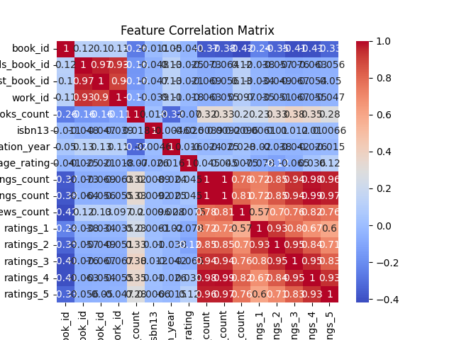
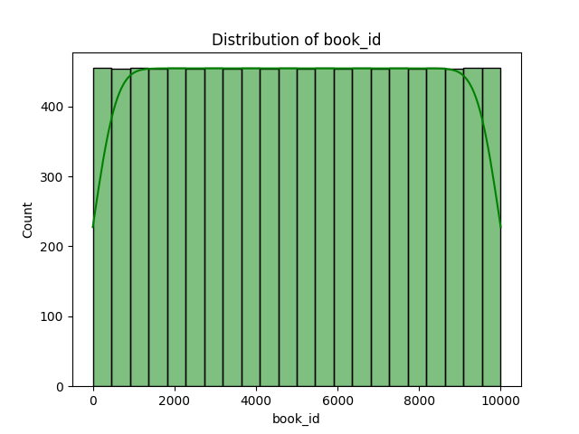
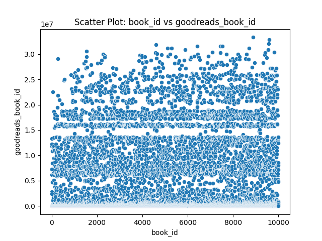
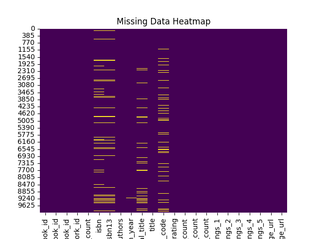

# Dataset Analysis Report

## Overview
- Total Rows: 10000
- Total Columns: 23

### Column Details:
- book_id: int64
- goodreads_book_id: int64
- best_book_id: int64
- work_id: int64
- books_count: int64
- isbn: object
- isbn13: float64
- authors: object
- original_publication_year: float64
- original_title: object
- title: object
- language_code: object
- average_rating: float64
- ratings_count: int64
- work_ratings_count: int64
- work_text_reviews_count: int64
- ratings_1: int64
- ratings_2: int64
- ratings_3: int64
- ratings_4: int64
- ratings_5: int64
- image_url: object
- small_image_url: object

## Insights from Analysis
Based on the dataset summary provided, here are key insights:

1. **Dataset Overview**:
   - The dataset contains 10,000 rows and 23 columns, indicating a substantial collection of book-related data.

2. **Column Types and Structure**:
   - The dataset includes various data types such as integers (`int64`), floating points (`float64`), and objects (`O`), suggesting a mix of numerical and categorical data.
   - Key columns include IDs, titles, authors, publication years, ratings, and images.

3. **Null Values**:
   - Several columns have null values, notably:
     - `isbn` (700 nulls)
     - `isbn13` (585 nulls)
     - `original_publication_year` (21 nulls)
     - `original_title` (585 nulls)
     - `language_code` (1084 nulls)
   - This indicates potential issues with book identification and publication information that may need addressing.

4. **Ratings and Popularity**:
   - The `average_rating` column shows a generally high average across the sample, with the highest being 4.44 for "Harry Potter and the Sorcerer's Stone".
   - The `ratings_count` and `work_ratings_count` statistics suggest that popular titles have substantial engagement, with counts reaching millions.

5. **Author Representation**:
   - The dataset features notable authors such as Suzanne Collins, J.K. Rowling, and Stephenie Meyer, implying a focus on popular literature.

6. **Publication Trends**:
   - The data includes books published from as early as 1925 to more contemporary titles, indicating a broad range of publication years.

7. **Visual Content**:
   - The presence of image URLs suggests the dataset can be utilized for visual representation, enhancing user engagement, especially in a browsing or recommendation context.

8. **Language Diversity**:
   - The `language_code` column has 1084 nulls, which may indicate a lack of language representation for some books, potentially limiting audience reach.

**Next Steps**:
- Consider cleaning the dataset to address the null values, especially for critical identifiers like `isbn` and `language_code`.
- Further analyses could include trends in ratings over publication years, author popularity, and the impact of language on book ratings and counts.

## Visualizations
1. Correlation Matrix: 
2. Histogram: 
3. Scatter Plot: 
4. Pairwise Relationships: 
5. Missing Data Heatmap: 
