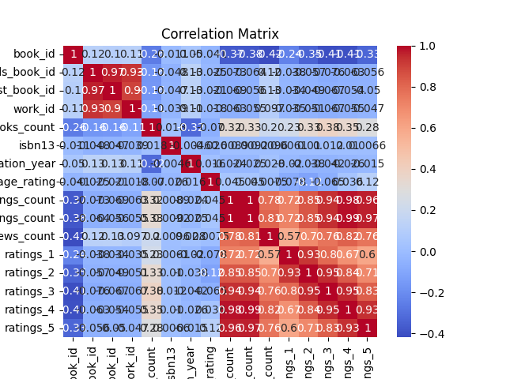
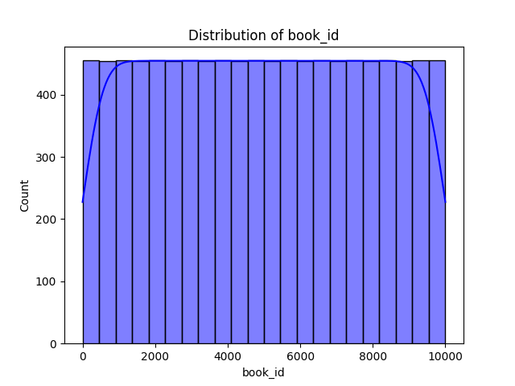
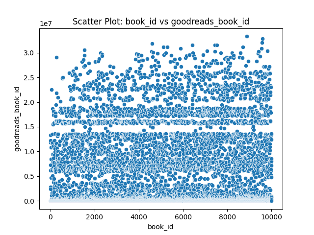
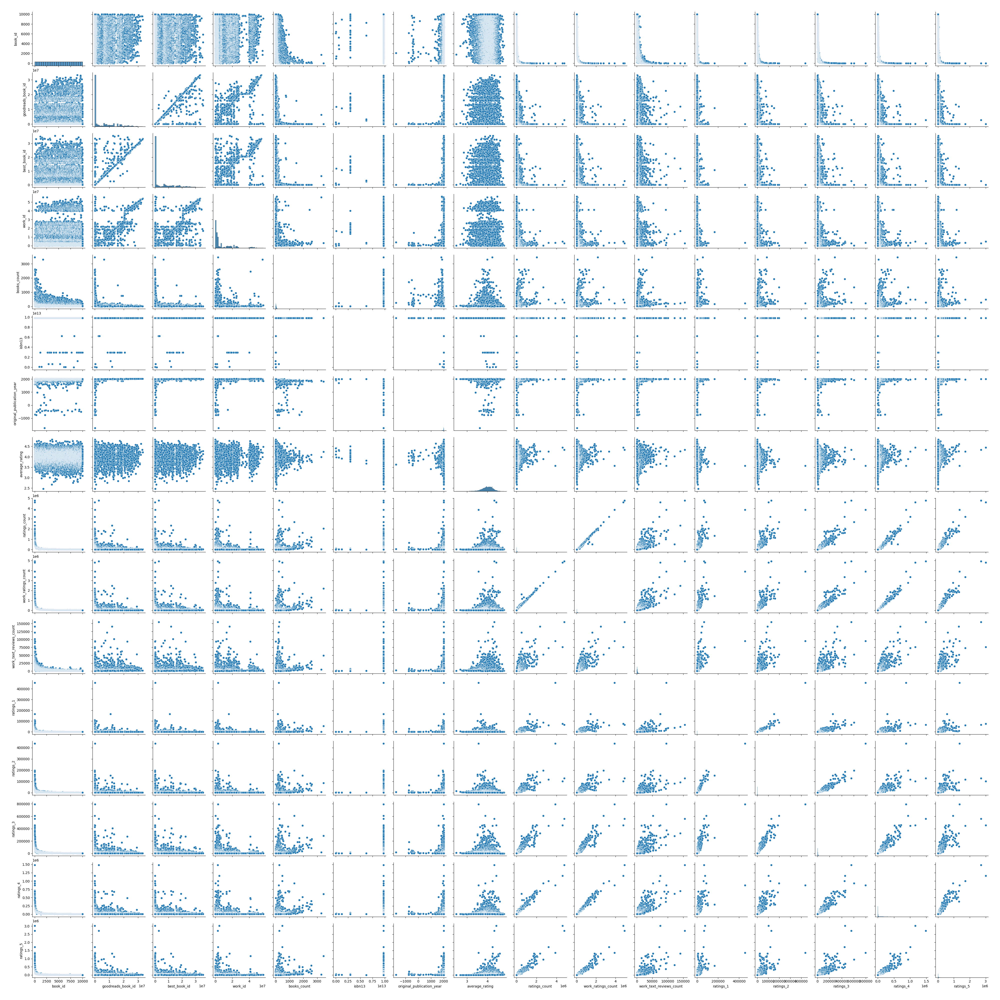

# Automated Dataset Analysis

## Dataset Summary
- Number of Rows: 10000
- Number of Columns: 23

### Columns and Data Types:
- book_id: int64
- goodreads_book_id: int64
- best_book_id: int64
- work_id: int64
- books_count: int64
- isbn: object
- isbn13: float64
- authors: object
- original_publication_year: float64
- original_title: object
- title: object
- language_code: object
- average_rating: float64
- ratings_count: int64
- work_ratings_count: int64
- work_text_reviews_count: int64
- ratings_1: int64
- ratings_2: int64
- ratings_3: int64
- ratings_4: int64
- ratings_5: int64
- image_url: object
- small_image_url: object

## Analysis Narrative
The dataset comprises 10,000 entries related to books, with 23 columns capturing various attributes. Here’s a brief analysis and insights drawn from the dataset:

### Overview of Data Structure
- **Columns**: The dataset contains diverse information including identifiers (e.g., `book_id`, `goodreads_book_id`), publication details (e.g., `original_publication_year`, `isbn`, `isbn13`), author information (e.g., `authors`), and ratings (e.g., `average_rating`, `ratings_count`).
- **Data Types**: The dataset combines numeric types (integers and floats) and object types (strings for titles, authors, and URLs).

### Missing Values
- **Common Missing Values**:
  - `isbn` has 700 missing values, which is significant as ISBN is essential for book identification.
  - `isbn13` has 585 missing values, indicating a potential gap in the dataset for referencing books by their ISBN-13.
  - `original_publication_year` has 21 missing values, which may hinder chronological analysis of books.
  - `original_title` is missing for 585 entries, limiting the ability to track original works.
  - `language_code` has 1,084 missing values, which affects language-specific analyses.

### Rating Insights
- **Average Ratings**: The average ratings range from 3.57 to 4.44, indicating a generally favorable reception among the books in this dataset.
- **Ratings Distribution**: The distribution of ratings (1-5) shows that higher ratings (4 and 5) dominate across most books, which suggests that the dataset may be skewed towards popular or well-received titles.
- **Ratings Count**: Books like "The Hunger Games" and "Harry Potter" have exceptionally high ratings counts (over 4 million), reflecting their popularity and wide readership.

### Publication Year Insights
- **Publication Trends**: The dataset includes books published as far back as 1925 and as recent as 2008. Analyzing trends in average ratings over time could provide insights into changing reader preferences and the evolution of literary styles.

### Author Diversity
- **Author Representation**: Several popular authors are represented multiple times (e.g., Suzanne Collins, J.K. Rowling), indicating a potential concentration around certain authors and genres. This could lead to a recommendation bias if used in a recommendation system.

### Language Diversity
- **Language Codes**

## Visualizations
1. Correlation Matrix: 
2. Distribution Plot: 
3. Scatter Plot: 
4. Pair Plot: 
5. Missing Values Heatmap: 
