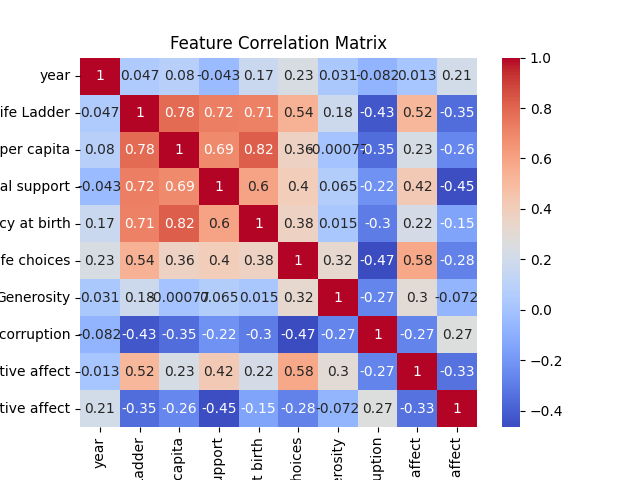
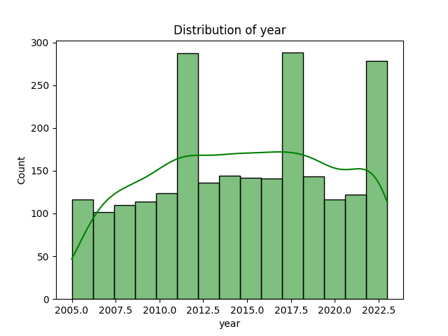
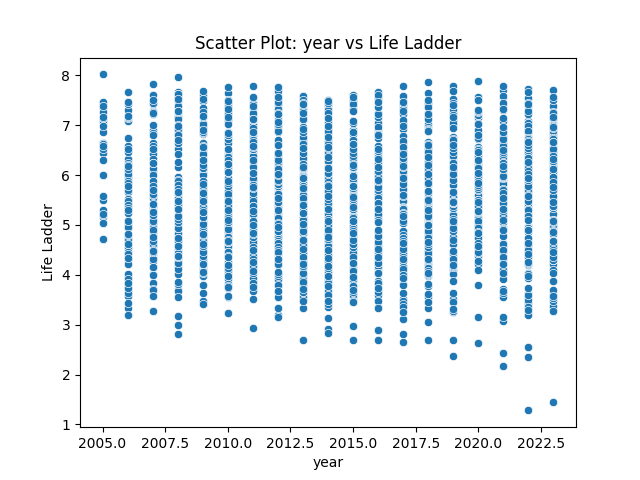
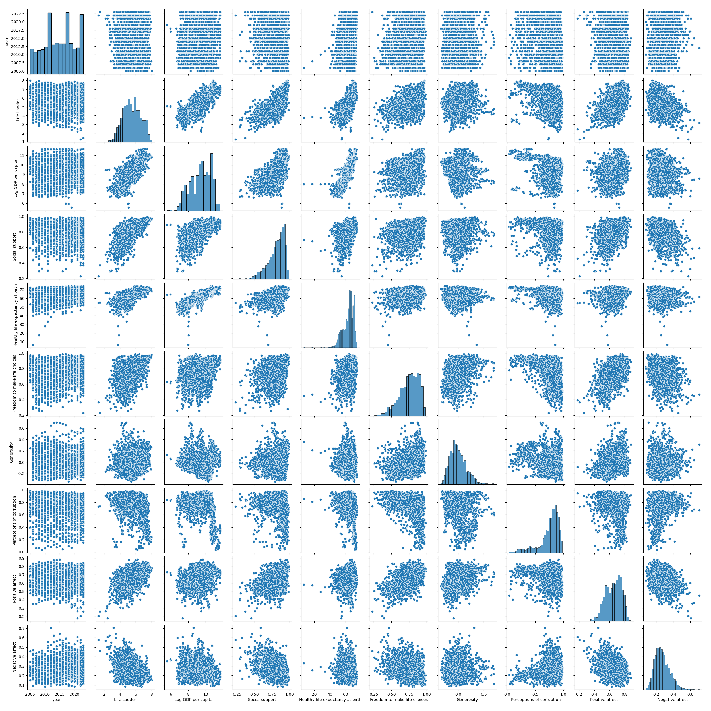

# Dataset Analysis Report

## Overview
- Total Rows: 2363
- Total Columns: 11

### Column Details:
- Country name: object
- year: int64
- Life Ladder: float64
- Log GDP per capita: float64
- Social support: float64
- Healthy life expectancy at birth: float64
- Freedom to make life choices: float64
- Generosity: float64
- Perceptions of corruption: float64
- Positive affect: float64
- Negative affect: float64

## Insights from Analysis
Based on the provided dataset summary, here are some key insights:

1. **Dataset Composition**:
   - The dataset contains a total of 2,363 rows and 11 columns, covering various indicators related to well-being and socio-economic factors across countries.

2. **Column Types**:
   - The data includes both categorical (Country name) and numerical (year, Life Ladder, Log GDP per capita, etc.) types, with most columns representing continuous variables.

3. **Null Values**:
   - There are significant missing values in several columns:
     - **Generosity** has the highest missing values (81), indicating potential issues with data collection or reporting.
     - Other notable columns with missing values include **Perceptions of corruption** (125) and **Healthy life expectancy at birth** (63). 
   - The absence of null values in the **Country name** and **year** columns ensures that each entry is identifiable by country and time.

4. **Sample Records**:
   - The sample data for Afghanistan across different years shows fluctuations in the **Life Ladder** score (3.724 to 4.758), suggesting changes in perceived well-being over time.
   - Other indicators like **Log GDP per capita** and **Social support** show gradual increases, which could correlate with improvements in life quality.

5. **Potential Analysis Areas**:
   - Correlation Analysis: Investigate relationships between the **Life Ladder** and other metrics such as **Log GDP per capita**, **Social support**, and **Freedom to make life choices**.
   - Trend Analysis: Assess how well-being indicators change over time across different countries, focusing on those with significant missing data to understand their implications.
   - Comparison Between Countries: Evaluate how different countries rank in terms of happiness, social support, and corruption perceptions, which could provide insights for policy-making.

In summary, the dataset offers a rich opportunity for analysis, particularly in understanding the dynamics of well-being indicators and their interrelations, despite the challenges posed by missing data in several critical fields.

## Visualizations
1. Correlation Matrix: 
2. Histogram: 
3. Scatter Plot: 
4. Pairwise Relationships: 
5. Missing Data Heatmap: 
