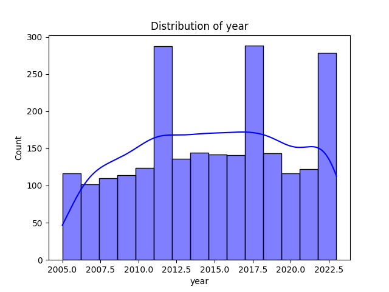

# Automated Dataset Analysis

## Dataset Summary
- Number of Rows: 2363
- Number of Columns: 11

### Columns and Data Types:
- Country name: object
- year: int64
- Life Ladder: float64
- Log GDP per capita: float64
- Social support: float64
- Healthy life expectancy at birth: float64
- Freedom to make life choices: float64
- Generosity: float64
- Perceptions of corruption: float64
- Positive affect: float64
- Negative affect: float64

## Analysis Narrative
The dataset consists of 2,363 rows and 11 columns, capturing various socio-economic and psychological metrics across different countries and years. Below are some key insights and analyses based on the provided summary:

### 1. **Column Overview**:
   - The dataset includes key indicators such as 'Life Ladder', 'Log GDP per capita', 'Social support', and several others that likely correspond to aspects of well-being and happiness.
   - The 'year' column indicates that the data spans multiple years, which may be useful for trend analysis.

### 2. **Missing Values**:
   - The dataset has missing values in several columns, with 'Generosity' having the highest number of missing entries (81). This could impact analyses that involve this variable, suggesting a need for imputation or exclusion of this feature in certain analyses.
   - Other significant missing values include 'Perceptions of corruption' (125 missing) and 'Healthy life expectancy at birth' (63 missing). Careful handling of these variables will be essential for maintaining data integrity.

### 3. **Key Variables**:
   - **Life Ladder**: This likely serves as a primary measure of subjective well-being. Understanding its correlation with other variables can provide insights into factors influencing happiness across different countries.
   - **Log GDP per capita**: This economic indicator is often used to gauge a country's economic performance and may correlate positively with the Life Ladder score.
   - **Social Support**: A critical factor for well-being. Higher levels of social support may correlate with higher Life Ladder scores, suggesting that community and relationships play a vital role in happiness.
   - **Freedom to make life choices**: This may reflect the perceived autonomy individuals feel in their lives, which could significantly relate to overall happiness.

### 4. **Sample Data Analysis**:
   - The sample data from Afghanistan showcases varying trends over the years in terms of 'Life Ladder', 'Log GDP per capita', and other metrics. For instance, the Life Ladder scores fluctuate, indicating changes in well-being over time.
   - Other countries' trends can be examined similarly to understand how different factors contribute to life satisfaction over time.

### 5. **Potential Analyses**:
   - **Correlation Analysis**: Assess the correlation between 'Life Ladder' and other continuous variables such as 'Log GDP per capita', 'Social support', and 'Freedom to make life choices' to identify which factors most strongly influence perceived well-being.
   - **Trend Analysis

## Visualizations
1. Correlation Matrix: 
2. Distribution Plot: 
3. Scatter Plot: 
4. Pair Plot: 
5. Missing Values Heatmap: 
