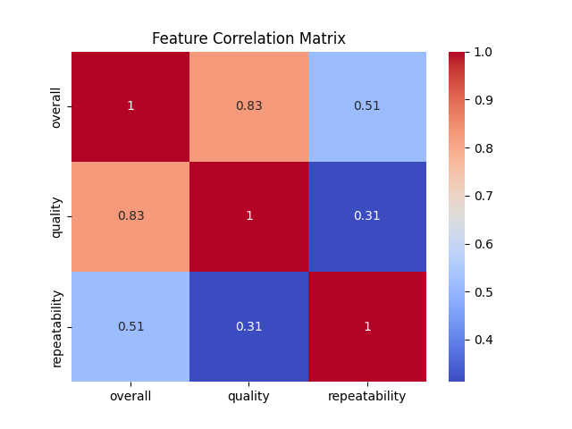
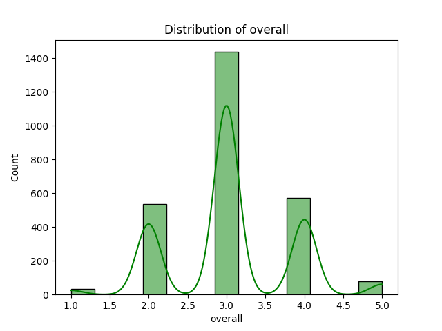
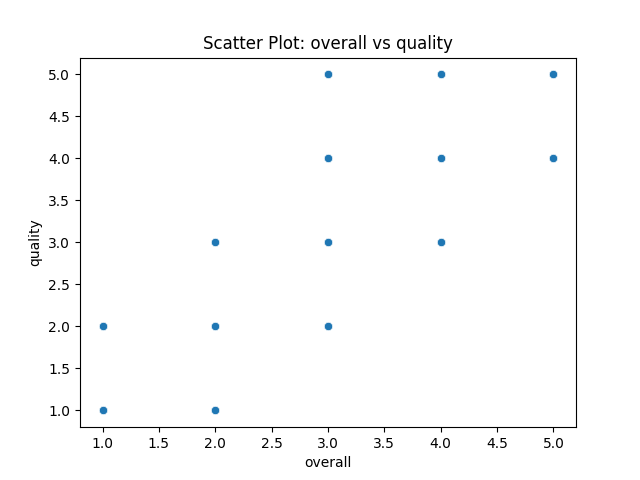
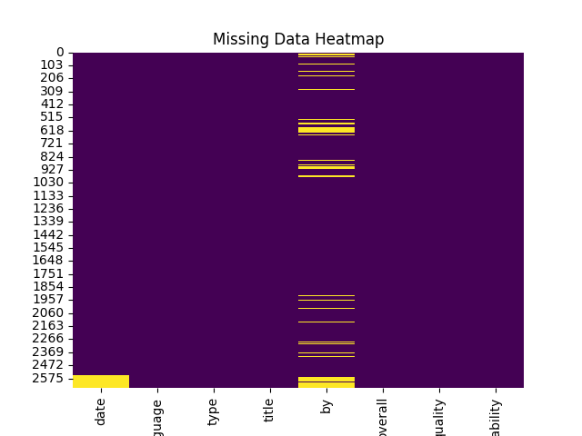

# Dataset Analysis Report

## Overview
- Total Rows: 2652
- Total Columns: 8

### Column Details:
- date: object
- language: object
- type: object
- title: object
- by: object
- overall: int64
- quality: int64
- repeatability: int64

## Insights from Analysis
Based on the provided dataset summary, here are some key insights:

1. **Dataset Composition**:
   - The dataset contains **2652 rows** and **8 columns**, capturing various aspects of movie reviews or entries.

2. **Data Types**:
   - The dataset includes a mix of categorical (language, type, title, by) and numerical variables (overall, quality, repeatability), along with a date column.

3. **Null Values**:
   - There are **99 missing values** in the 'date' column, which is significant and may impact time-based analyses.
   - The 'by' column has **262 missing values**, indicating a potential issue with incomplete data for contributors or creators.

4. **Ratings Overview**:
   - The 'overall' rating ranges from 2 to 4, with a majority of reviews likely skewed towards the higher end (as indicated by sample records).
   - The 'quality' ratings also vary, with a similar distribution observed in the sample, suggesting varying perceptions of movie quality.

5. **Language Distribution**:
   - The dataset includes multiple languages, with Tamil and Telugu represented in the sample. Further analysis could reveal the distribution of languages across the entire dataset.

6. **Potential Analysis Areas**:
   - Investigating the correlation between 'overall' and 'quality' ratings could provide insights into reviewer sentiment.
   - Analyzing the impact of missing 'by' data on overall ratings may highlight biases in the dataset.
   - Time-series analysis of the 'date' column could reveal trends in movie ratings over time.

7. **Actionable Insights**:
   - Addressing the missing values, particularly in the 'date' and 'by' columns, could enhance the dataset's reliability.
   - Segmenting the analysis by language or type could uncover unique trends and preferences within specific demographics.

Overall, the dataset presents a comprehensive view of movie ratings but requires careful handling of missing data for more robust insights.

## Visualizations
1. Correlation Matrix: 
2. Histogram: 
3. Scatter Plot: 
4. Pairwise Relationships: 
5. Missing Data Heatmap: 
