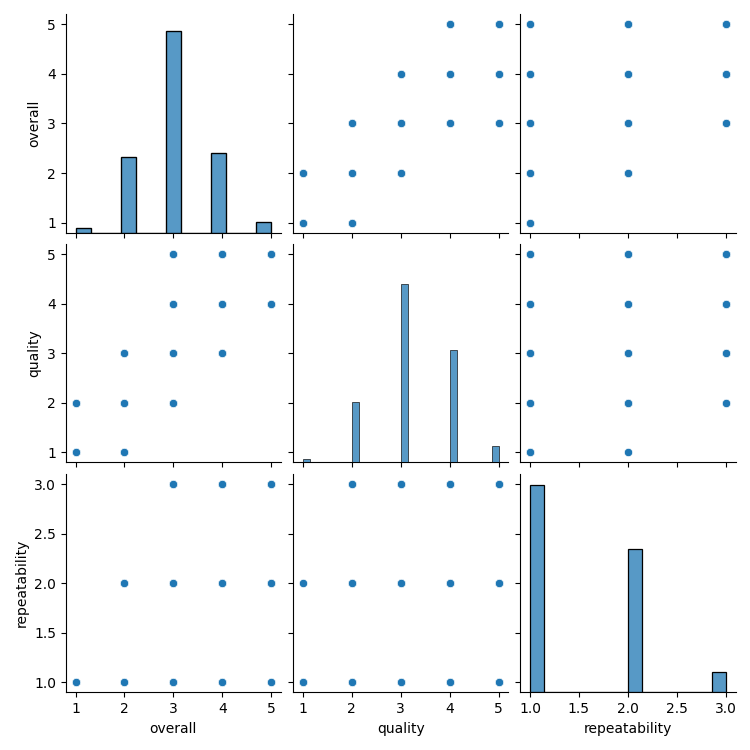

# Automated Dataset Analysis

## Dataset Summary
- Number of Rows: 2652
- Number of Columns: 8

### Columns and Data Types:
- date: object
- language: object
- type: object
- title: object
- by: object
- overall: int64
- quality: int64
- repeatability: int64

## Analysis Narrative
Based on the dataset summary provided, here are some key insights and analysis:

### Overview
- The dataset consists of 2,652 entries (rows) and 8 attributes (columns) related to movies.
- The columns include metadata such as the release date, language, type, title, contributors (by), and ratings (overall, quality, repeatability).

### Missing Values
- There are notable missing values:
  - 99 entries in the 'date' column, which is significant as it may affect temporal analyses or trends.
  - 262 entries in the 'by' column, indicating that many movies lack information on their contributors. This could hinder analyses related to authorship or collaboration.
- The remaining columns do not have any missing values, which is beneficial for maintaining data integrity in analyses related to ratings.

### Data Characteristics
- **Languages**: The dataset appears to primarily focus on Tamil and Telugu films, as indicated by the sample data. This suggests a regional focus which might be important for targeted analyses.
- **Types**: All entries in the sample data are classified as 'movies', indicating a homogeneous dataset in terms of type.
- **Ratings**:
  - The 'overall' ratings range from 2 to 4 in the sample, indicating a generally moderate perception of the movies.
  - The 'quality' ratings also align closely with the overall ratings, suggesting that users perceive the quality and overall enjoyment of the movies similarly.
  - The 'repeatability' rating is consistently set to 1 in the sample, possibly indicating that these movies are not typically recommended for repeated viewings, or that the dataset may lack data on this aspect.

### Potential Analyses
1. **Temporal Analysis**: With dates missing for some entries, it would be useful to focus on the available records to analyze trends over time, such as the distribution of movie ratings by month/year if more dates were complete.
2. **Language Analysis**: Exploring the quality and overall ratings based on language could reveal insights into regional preferences and the general reception of Tamil versus Telugu films.
3. **Author Contributions**: Given the missing data in the 'by' column, investigating the impact of contributors on movie ratings could be limited. However, for the available data, one could analyze the correlation between specific authors and the quality ratings.
4. **Quality vs. Overall Ratings Correlation**: A statistical correlation analysis could be performed between 'quality' and 'overall' ratings to confirm the

## Visualizations
1. Correlation Matrix: 
2. Distribution Plot: 
3. Scatter Plot: 
4. Pair Plot: 
5. Missing Values Heatmap: 
